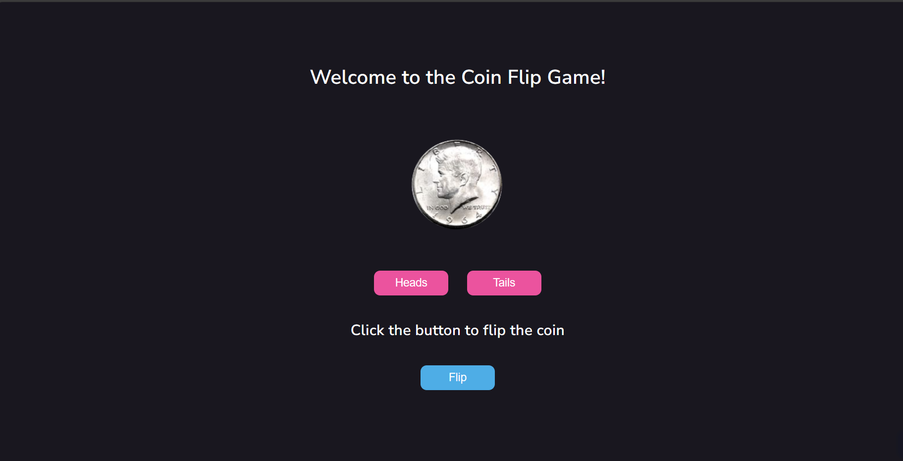

# coin-flip-game
Welcome to the Coin Flip Game! This web application offers a playful and interactive experience, allowing users to make guesses on the outcome of a virtual coin flip. The game showcases a simple yet engaging design, making it a fun way to test your luck. Give it a try and see if you can guess correctly!
Here is a screenshot of my game:



## HTML Structure
The *head* of HTML file which includes some important links like:
- **Fonts:** Nunito Sans font from Google Fonts.
- **Stylesheet link:** Links to the external CSS file for styling.
- **Script Link**: Links to the external JavaScript file with deferred execution for optimal loading.
```
  <link rel="preconnect" href="https://fonts.googleapis.com" />
  <link rel="preconnect" href="https://fonts.gstatic.com" crossorigin />
  <link rel="stylesheet" href="https://fonts.googleapis.com/css2?family=Nunito+Sans:opsz,wght@6..12,300;6..12,400;6..12,500;6..12,600&display=swap"/>
  <link rel="stylesheet" href="./assets/style/index.css" media="all" />
  <script src="./assets/script/index.js" defer></script>
```

## CSS Styles for the coin-flip game
This CSS code is the *global reset* which is typically placed at the beginning of the stylesheets. This helps ensure that elements look the same across various browsers by removing default styling differences.
```
* {
  margin: 0;
  padding: 0;
  outline: none;
  border-style: none;
  vertical-align: baseline;
  box-sizing: border-box;
}
```

`animation` applies the animation to the coin image with the class "animate."
Keyframes `rotatey` defines a rotation animation named "rotatey. The animation starts from a rotation of 0 degrees (initial state) and ends with a rotation of 360 degrees (final state).
```
  .animate {
    animation: rotatey 0.3s linear infinite;
  }
  @keyframes rotatey {
    from {
      transform: rotateY(0deg);
    }
    to {
      transform: rotateY(360deg);
    }
  }
```

## JavaScript code
### Utility Functions
- `onEvent(event, selector, callback)`: Attaches an event listener to a selector.
- `select(selector, parent = document)`: Selects an element with the given selector.
```
function onEvent(event, selector, callback) {
  return selector.addEventListener(event, callback);
}
function select(selector, parent = document) {
  return parent.querySelector(selector);
}
```
### Resetting the game
- `resetGame()`: Resets the coin images and user choice.
  ```
  let userChoice = null;
  function resetGame() {
  imgHeads.style.display = "block";
  imgTails.style.display = "none";
  userChoice = null;
  imgHeads.classList.remove("rotatey");
  }
  resetGame();
  ```

The `compareCoin()` function is responsible for simulating a coin flip and displaying the result after a short delay. Here, a random number (either 0 or 1) is generated representing heads or tails. A switch statement is used to check the combination of user choice and random number. The result messageis updated and corresponding coin image is shown, hiding the other. The dispaly result is delayed by 3000 milliseconds (3 seconds) using `setTimeout` function.

## Demo
You can view a live demo of the Coin Flip Game [here](https://gurlinkaur23.github.io/coin-flip-game/).

Enjoy playing the Coin Flip Game! If you have any feedback or suggestions, feel free to open an issue or contribute to the project.


